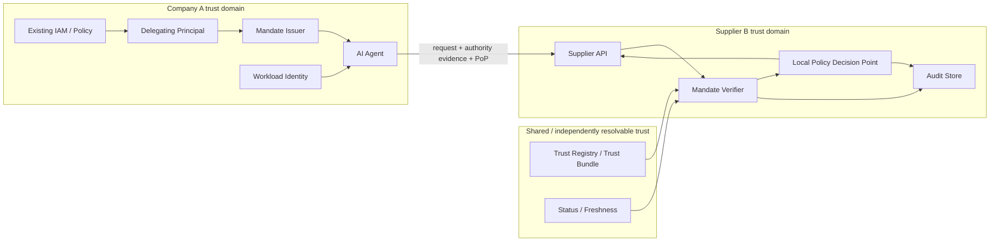

# Project Mandate - Technical Architecture

## Status

**Draft v0.1 - Phase 0 architecture**

This architecture defines the common logical model used by prototype implementations A, B and C. It deliberately avoids choosing a new protocol, cryptographic primitive or blockchain.

## Architecture objective

Enable an external organisation to decide whether a software agent is authorised to perform a specific action on behalf of another organisation without requiring direct integration with the originating organisation's IAM for every transaction.

The verifier must be able to establish:

1. the authority originated from a recognised principal;
2. the presenting workload controls the key to which the authority is bound;
3. the requested action is within the mandate's resource, action, value, purpose and time constraints;
4. any delegation has preserved or narrowed authority rather than broadened it;
5. the authority is sufficiently current for the risk of the transaction;
6. the evidence is bound to the current verifier and request;
7. only information required for the decision is disclosed where practical.

The verifier always makes the final local ALLOW/DENY decision.

## Reference actors

### Company A - Principal organisation
Owns the business authority being delegated. Company A continues to use its existing IAM and internal policy systems.

### Delegating principal
The human or organisational process authorised to create the root mandate.

### Mandate Issuer
Creates and signs the portable authority artefact from approved Company A authority. The issuer is part of Company A's trust domain.

### Agent
Autonomous software acting on behalf of Company A. The agent does not become the source of authority simply because it possesses a credential. Its authority is derived from the principal.

### Workload Identity Provider
Binds a cryptographic key to the running agent/workload. Candidate standards for implementation C included SPIFFE/WIMSE-style workload credentials and proof of possession.

### Supplier B - External verifier
An independently governed organisation receiving an action request from the agent. Supplier B does not share Company A's IAM and should not need a bespoke Company A IAM integration to evaluate the portable mandate.

### Mandate Verifier
Validates signatures/proofs, authority lineage, request binding, freshness and machine-readable constraints. It returns verified authority facts to Supplier B's policy decision point.

### Policy Decision Point
Supplier B's local policy engine. It decides whether the verified authority is acceptable for the requested operation. Project Mandate does not replace this component.

### Trust / Status Provider
Provides independently verifiable information needed to decide whether an issuer is trusted and whether an authority artefact is sufficiently current.

### Audit Store
Records issuance, presentation, verification and decision evidence required for investigation and dispute handling. Audit data remains local by default.

## Logical architecture

## Primary trust boundaries

### TB1 - Company A internal boundary
Company A is responsible for deciding who or what may create a root mandate.

### TB2 - Mandate issuance boundary
The signed mandate crosses from Company A's internal control plane into a portable artefact usable by a workload.

### TB3 - Workload possession boundary
Possessing a mandate alone must not be sufficient to act. The invocation should be bound to a key controlled by the intended workload using proof of possession.

### TB4 - Organisational boundary
The request crosses from Company A's trust domain into Supplier B. Supplier B should verify evidence rather than join Company A's IAM domain.

### TB5 - Trust/status boundary
Supplier B must decide which issuers, schemas, policy versions and status evidence it accepts. Trust is governed, not created by cryptography.

### TB6 - Verification-to-authorization boundary
Cryptographic verification establishes evidence. Supplier B's local policy determines whether that evidence is sufficient to perform the requested operation.

## Core architectural separation

Project Mandate separates four concerns that are often conflated:

### 1. Authentication
**What workload/key is making the request?**

Candidate mechanisms: OIDC, mTLS, DPoP, SPIFFE/WIMSE-style workload identity.

### 2. Authority provenance
**Who authorised this workload to act, and how was that authority derived?**

Candidate mechanisms: OAuth grants/tokens, signed credentials, capability chains.

### 3. Constraint verification
**Does this exact action remain inside the delegated mandate?**

Examples: action, resource, transaction value, aggregate value, jurisdiction, purpose, expiry, approval threshold and delegation depth.

### 4. Local authorization
**Does Supplier B choose to accept this authority for this operation?**

This remains a Supplier B policy decision.

## First mandate semantics

| Field | Reference value |
|---|---|
| Principal | Company A |
| Actor | TravelAgent-17 / workload key |
| Purpose | business-travel |
| Actions | book, purchase |
| Resources | rail, hotel |
| Per-transaction limit | GBP 800 |
| Aggregate limit | GBP 2,000 |
| Jurisdiction | UK |
| Human approval | required above GBP 500 |
| Expiry | explicit timestamp |
| Further delegation | prohibited |

## Request binding

Every high-risk invocation should be bound to a transaction context containing, at minimum:

- verifier/audience;
- nonce or replay-resistant challenge;
- request or canonical transaction hash;
- transaction identifier;
- presenting workload key or proof-of-possession reference;
- relevant time/freshness context.

## Freshness and revocation

There is no universal offline freshness solution. The prototype explicitly treated freshness as a risk trade-off.

Initial model:

- short-lived low-value mandate: expiry may be sufficient;
- medium-risk mandate: cached/signed status snapshot plus short lifetime;
- high-risk mandate: online status/current-state verification may be required.

## Privacy position

Privacy minimisation is secondary to reliable authority verification. The prototype focused on hiding unnecessary internal information such as unused higher-level spending limits, unrelated permissions, unrelated delegates and internal delegation structure.

## Audit model

The verifier should be able to retain evidence sufficient to answer after a dispute:

- which principal/issuer was trusted;
- which authority facts were proven;
- which request and transaction were evaluated;
- which status/freshness evidence was used;
- which workload key presented the request;
- which policy version made the decision;
- why the final result was ALLOW or DENY.

## Architecture for A, B and C

### Implementation A - Conventional baseline
Company A remains online in the authorisation path using OIDC/OAuth, Rich Authorization Requests and request binding.

### Implementation B - Credential baseline
Authority facts are represented through credential standards and presented to Supplier B using a conventional trust/status model and selective disclosure where practical.

### Implementation C - Candidate VDA
Compose existing components for root authority evidence, attenuable capability semantics, delegated authority lineage, workload identity, request binding, trust/status resolution, selective disclosure where useful and verifier-local policy.

## Decision metric

The central architecture metric was not cryptographic latency. It was:

> **Can Supplier B support one interoperable verification model for mandates from multiple organisations, while receiving enough evidence to manage risk and requiring materially less pairwise IAM integration?**

The later research concluded that existing mechanisms could reproduce the required behaviour and that the residual profile layer did not form a sufficiently defensible commercial product.
